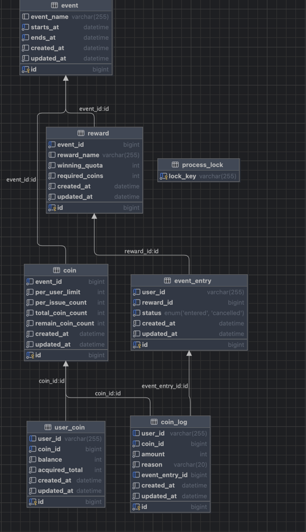

# k-coin-api

코인 발급 및 휴가 응모 API

행사(Event) - 리워드(Reward) - 코인(Coin) 발급/응모/취소를 지원하는 백엔드 서비스입니다.  
사용자는 코인을 발급받아 리워드(휴가권)에 응모하고, 취소 시 코인 환불이 이뤄집니다.

---

## Tech Stack

- **Language**: Kotlin (JDK 21)
- **Framework**: Spring Boot 3.5.4 (Spring MVC, Spring Data JPA, Springdoc OpenAPI)
- **Build**: Gradle (Wrapper 포함)
- **RDBMS**: MySQL
- **Test**: Testcontainers(MySQL) / 단위 테스트 H2

---

## 프로젝트 구조

```
com.jasim.kcoinapi
├─ coin           # 코인 발급/조회 도메인
├─ event          # 리워드 응모/취소/조회 도메인
├─ common         # 공통 락(ProcessLock), Enums, 공통 응답, Audit
├─ config         # 프로젝트 공통 설정
├─ exception      # 예외 처리, 에러 로그
└─ integration    # 통합 테스트 (Testcontainers)
```

---

## 테이블 및 관계

> 모든 테이블은 **논리적 관계**만 있고 **물리적 FK**는 두지 않았습니다.

- event(이벤트) **1 — N** reward(리워드/휴가권)
- event(이벤트) **1 — N** coin(이벤트에 발급된 코인)
- coin(코인) **1 — N** user_coin(사용자에게 발급된 코인 정보)
- reward(이벤트 리워드) **1 — N** event_entry(리워드 응모 이력)
- coin_log: 코인 로그(지급 ISSUE / 응모 ENTERED / 응모 취소 CANCEL)
- process_lock: 분산 락(행 단위)용 테이블

---

## ERD



---

## DDL / Seed Data

기본 이벤트/리워드/코인 초기값을 제공합니다.  
유저 코인 정보/응모 이력/코인 로그는 **운영 실행용 Seed에는 포함하지 않고**, 통합 테스트에서만 샘플 데이터를 포함합니다.

- **DDL**: `src/main/resources/db/coin-schema.sql`
- **Seed**: `src/main/resources/db/init-data.sql`

---

## 실행 방법

### 사전 요구사항

- JDK 21
- Docker

### Docker로 MySQL 실행

```bash
docker run --name kcoin-mysql -p 3306:3306 \
  -e MYSQL_DATABASE=kcoin_db \
  -e MYSQL_USER=kcoin -e MYSQL_PASSWORD=kcoinpass \
  -e MYSQL_ROOT_PASSWORD=root \
  -d mysql:8.0
```

---

## API Documentation

- Swagger UI: `http://localhost:8080/swagger-ui/index.html`

### 1) 코인 발급

**Request**

```http
POST /v1/coins/issue-coin
Content-Type: application/json

{
  "eventId": 1,
  "coinId": 1,
  "userId": "jksim"
}
```

**Response**

```json
{
  "status": "OK",
  "data": true
}
```

---

### 2) 전체 코인 현황

**Request**

```http
GET /v1/coins/summary/{coinId}
```

**Response (예시)**

```json
{
  "status": "OK",
  "data": {
    "remainCoinCount": 900,
    "userCoinInfo": [
      {
        "userId": "jksim",
        "acquiredTotal": 2,
        "balance": 1
      }
    ]
  }
}
```

---

### 3) 사용자 코인 현황

**Request**

```http
GET /v1/coins/summary/{coinId}/{userId}
```

**Response (예시)**

```json
{
  "status": "OK",
  "data": {
    "userId": "jksim",
    "acquiredTotal": 2,
    "balance": 1
  }
}
```

---

### 4) 리워드 응모/취소

**Request**

```http
POST /v1/event/entry-reward/{eventId}/{rewardId}/{userId}?status=ENTERED|CANCELLED
```

**Response**

```json
{
  "status": "OK",
  "data": true
}
```

---

### 5) 리워드별(휴가권 별) 응모 현황

**Request**

```http
GET /v1/event/reward-entry-summary/{eventId}/{rewardId}
```

**Response (예시)**

```json
{
  "status": "OK",
  "data": {
    "rewardName": "1일 휴가권",
    "totalEntryCount": 1,
    "canceledCount": 0,
    "uniqueEntryCount": 1
  }
}
```

---

### 6) 사용자별 응모 현황

**Request**

```http
GET /v1/event/user-reward-entry-summary/{eventId}/{rewardId}/{userId}
```

**Response (예시)**

```json
{
  "status": "OK",
  "data": {
    "userId": "1001",
    "entries": [
      {
        "eventName": "2025 여름휴가 이벤트",
        "rewardName": "1일 휴가권",
        "status": "ENTERED",
        "createTime": "2025-08-01T00:00:00Z",
        "updateTime": "2025-08-01T00:00:00Z"
      }
    ]
  }
}
```

---

## Race Condition 대응

- `process_lock` 테이블의 **행 락**으로 임계구역을 보호하여 모든 요청을 **순차 처리**합니다.
- 서비스 메서드 시작 시 `lockRepository.lockWithTimeout(lockKey)` 로 전역 락을 취득하여  
  **코인 발급/응모/취소 중 과발급·이중 처리**를 방지합니다.
- 트랜잭션 타임아웃 및 예외 처리를 통해 **교착·장기 대기**를 완화했습니다.

---

## 회고

오랜만에 순수 개발에 몰입할 수 있어 즐거웠습니다.  
일정에 쫓기기보다 요구사항을 명확히 하고 구현에 집중하는 흐름을 다시 점검할 수 있었습니다.

다음에 비슷한 과제를 한다면 RDBMS 제약이 없다는 가정 아래 **Redis 중심**으로 재구성해 보고 싶습니다.  
전역 락 대신 **Redis 분산 락**, 또는 **Lua 스크립트로 DECR을 원자적으로 수행 후 검증**하는 방식으로 바꾸면  
대규모 트래픽에서도 과발급/중복 처리를 더 안전하게 막을 수 있다고 생각합니다.